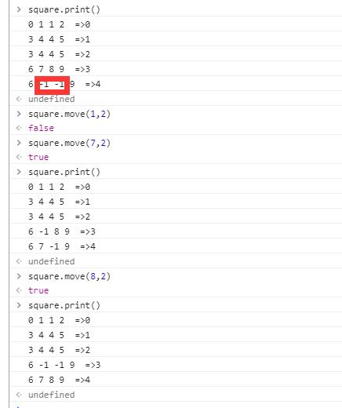

## Square 
移动方块小游戏-源码版


### npm install

```js
var Square = require('square');

var options = {
  x: 5,   //高
  y: 4,  //长
  shapes: [{  //类型
      x:1,y:1 //高 ，宽
    },{
      x:1,y:2
    },{
      x:2,y:2
    },{
      x:2,y:1
    }],
  data: [{ //数据
    x: 0,//坐标
    y: 0,
    shape: 0,//类型
    value: 0,//保存的唯一值。默认为 index
  },{
    x: 0,
    y: 1,
    shape: 1,
    value: 1
  },{
    x: 0, 
    y: 3,
    shape: 0,  
    value: 2 
  },{
    x: 1,
    y: 0,
    shape: 3,
    value: 3
  },{
    x: 1,
    y: 1,
    shape: 2,
    value: 4
  },{
    x: 1,
    y: 3,
    shape: 3,
    value: 5
  },{
    x: 3,
    y: 0,
    shape: 3,
    value: 6
  },{
    x: 3,
    y: 1,
    shape: 0,
    value: 7
  },{
    x: 3,
    y: 2,
    shape: 0,
    value: 8
  },{
    x: 3,
    y: 3,
    shape: 3,
    value: 9
  }]
};

var square = new Square(options);

```

## use

